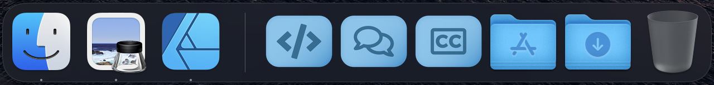
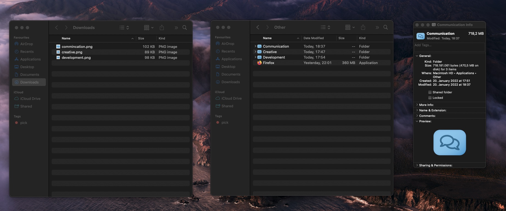

# Mac OS Dock custom folder icons

Because i am a big fan of structure and minimalism i remove all Apps from my Dock. There is only Finder (because it is mandatory) and custom folders for different kind of Apps. Therefore i created custom folder icons with [Affinity Designer](https://affinity.serif.com/en-us/designer/) and [Font Awesome](https://fontawesome.com/) ([this](https://github.com/B4rt0/Font-Awesome-Affinity-Assets) Affinity Assets package came in quiet handy).

## How to change the folder icon

1. Select the image file and press *CMD + C* to copy the image
2. Open the location of your Folder in Finder
3. Right-click --> get Info
4. Select the icon in the upper left corner and press *CMD + V*